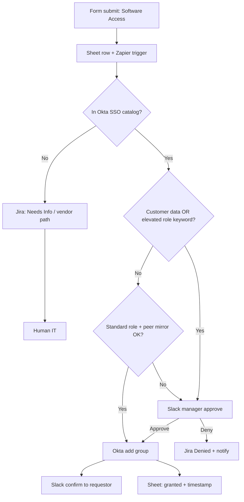
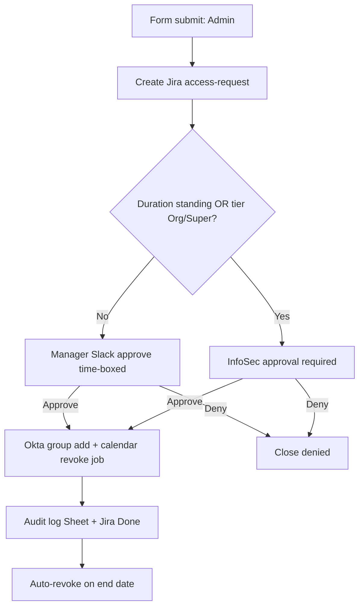
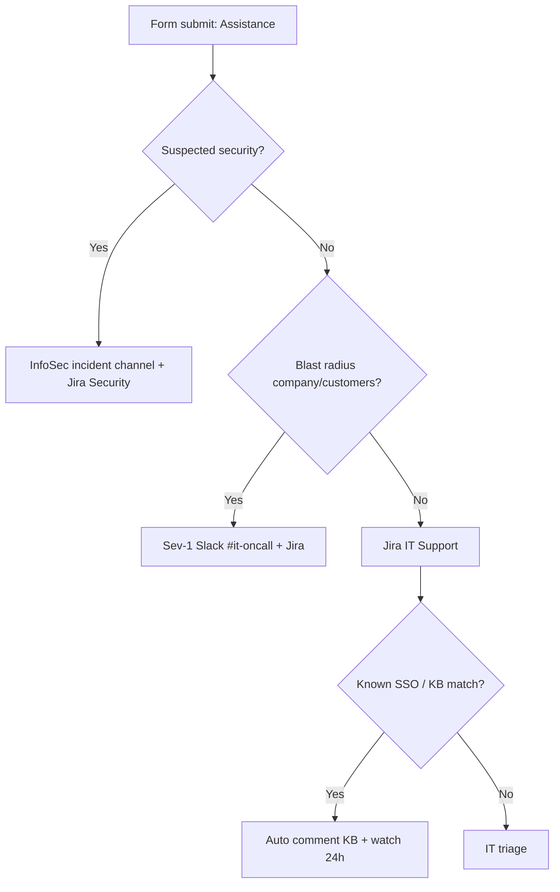
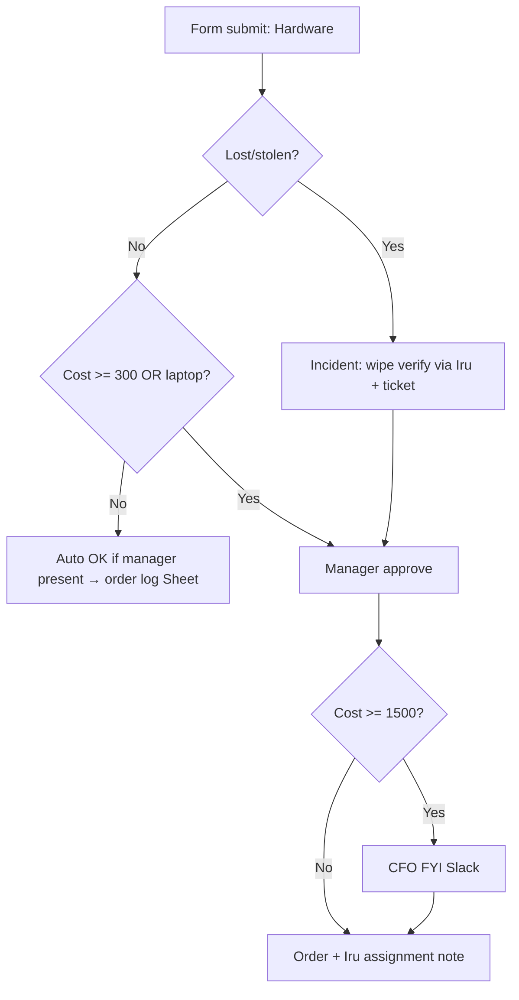
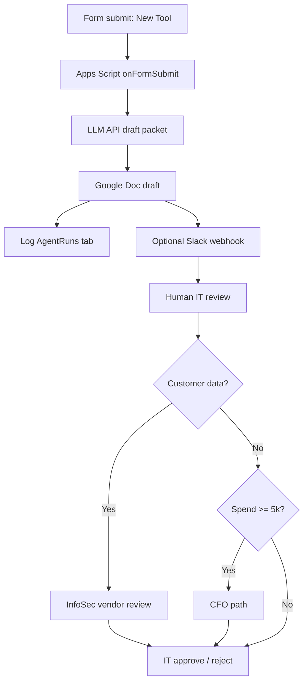

# Balto Software — IT Operations Engineer
## Practical Skills Assessment Submission

**Candidate:** Ryan  
**Role:** Operations & Automation Engineer (Full Time, Remote)  
**Submitted:** 2026-08-01  
**Format:** PDF write-up with links to build artifacts  

### Time log (honest)

| Task | Focused time | Notes / where I got stuck |
|------|--------------|---------------------------|
| 1A Form + question design | ~35 min | Cutting questions hard — resisted “ask everything.” Branching fall-through in Apps Script needed a careful re-read of `PageBreakItem.setGoToPage`. |
| 1B Five workflows + tooling/approval maps | ~40 min | Approval-line judgement took longer than drawing boxes. |
| 1C New-tool eval agent | ~30 min | Chose Apps Script over Zapier for Sheet-native audit log + one place for the next IT person to edit the prompt. |
| 2 Onboarding script | ~35 min | Mapping hygiene (ambiguous Staff Engineer groups) and messy CSV rows. |
| 3 Automation triage | ~20 min | Security bugs were obvious on first read; used AI to pressure-test for ones I missed (idempotency / Summary-as-group-id). |
| 4 Access review design | ~20 min | Non-SSO evidence collection is the hard part without a GRC tool. |
| 5 Writing samples | ~12 min | — |
| Write-up / packaging | ~25 min | — |
| **Total focused** | **~3.5 hr** | Wall-clock longer with breaks. Stopped polishing to preserve judgement notes. |

### How I used AI (graded area — steering, not being steered)

I used Cursor (Composer) as a build partner under my direction: I specified Balto constraints (buy-before-build, messy Okta RBAC, no GRC platform, SOC 2 instincts), rejected generic “enterprise IAM platform” suggestions, and kept Apps Script / Sheets / Slack as the default canvas.

**Accepted from AI:** scaffolding for Apps Script form builder + agent, Python argparse/CSV structure, Mermaid diagram drafts, first-pass bug list expansion.  
**Discarded / heavily edited:** Zapier-everywhere for 1C (Sheet-bound Apps Script is more inheritable for a one-person IT shop); auto-defaulting unknown roles to `All-Employees` (SOC 2 foot-gun); sleeping 30s “but with a longer timeout” as the Task 3 fix; GRC-platform-dependent access review; fluffy Task 5 copy that sounded like HR marketing.  
**Prompts (representative):** see Appendix A. Full task prompts and discarded alternatives are inline where they changed a decision.

### Artifact index (set links to “Anyone with the link — Viewer”)

| Artifact | Location |
|----------|----------|
| Live Google Form (respond) | https://docs.google.com/forms/d/e/1FAIpQLSfhO4euERygQNIVeU_CwLJQ_3iIDGepol5N6G0VK6dA9UMdiQ/viewform |
| Form edit URL | https://docs.google.com/forms/d/1QlSqNwKb1jUOti1MRlBoWSJ2hjVBkHjBjy9m-R4wNd4/edit |
| Response Sheet | https://docs.google.com/spreadsheets/d/1tuviORoS8B6qQAERvaq78rB7EHxOvtn_9t_TLxx9Ft4/edit |
| Form provisioner source (1A) | `task1/create_form.gs` |
| New-tool eval agent (1C) | `task1/new_tool_eval_agent.gs` (bound to response Sheet) — _Doc URL after first agent run_ |
| Onboarding script (2) | `task2/onboard.py` + `task2/role_mapping.yaml` + `task2/new_hires.csv` |
| Sample run output (2) | `task2/sample_output.txt` |
| Fixed access automation (3) | `task3/fixed_access_grant.py` |
| GitHub / Gist (recommended) | _paste public repo or gist URL_ |

---

# Task 1 — Intake form & multi-track automation

## 1A. Google Form — design

**Title:** Balto IT Request  
**Destination:** Google Sheet `Balto IT Request — Responses` (+ `AgentRuns` tab for 1C audit).  
**Provisioner:** `task1/create_form.gs` creates the live Form with section branching so a mouse request never sees admin-scope questions.

### Shared questions (every request)

| Question | Rationale |
|----------|-----------|
| Email (collected by Form) | Identity for Okta lookup / audit. |
| Manager email | Approval routing; contractors put sponsor. |
| Urgency (Sev-1…4) | Routes on-call vs backlog; stops “everything is urgent” Slack DMs. |
| Business justification | Minimum context so an agent/human can act without a follow-up DM. |
| Data classification involved | **Compliance signal** — drives approval path + evidence scope. |
| Request type (branches) | One form, five tracks. |

### Per-type questions (minimum to act) + compliance signals

| Type | Fields | Compliance / security signal (explicit) |
|------|--------|----------------------------------------|
| Software Access | Tool name, exact role, mirror teammate?, customer data?, optional end date | **Customer data Y/N** + temporary end date (least privilege / access reviews) |
| Admin / Elevated | Tool, elevated action, privilege tier, duration, least-privilege checklist, rollback plan | **Checklist + standing-admin → InfoSec**; duration forces time-box |
| Assistance / Bug | Tool, category, intended vs actual, blast radius, suspected security issue | **Security-incident fork** + blast radius for sev |
| Hardware | Type, specs, ship-to, lost/stolen?, cost estimate, asset tag | **Lost/stolen → wipe/incident**; **$300 / $1,500** finance thresholds |
| New Software Tool Eval | Vendor, URL, use case, audience, customer data?, spend band, alternatives, SSO need | **Customer data + spend band + SSO** → vendor review / CFO path |

### Cuts I refused to make (and why)

- Did **not** ask for employee ID, cost center, or device serial on every type — People Ops / Iru already hold those; asking again creates conflicting sources of truth.  
- Did **not** ask “list all permissions you might ever need” on Software Access — invites over-scoping; mirror-user + exact role is enough to grant.  
- Did **not** put legal DPA upload on the Form — that’s an InfoSec vendor step after the eval packet, not an employee self-serve field.

### Deliverables

- Live Form URL: https://docs.google.com/forms/d/e/1FAIpQLSfhO4euERygQNIVeU_CwLJQ_3iIDGepol5N6G0VK6dA9UMdiQ/viewform  
- Response Sheet URL: https://docs.google.com/spreadsheets/d/1tuviORoS8B6qQAERvaq78rB7EHxOvtn_9t_TLxx9Ft4/edit  
- Question table: above (compliance signals flagged).

---

## 1B. Automation design (five workflows)

### Tooling table

| Request type | Platform | Why |
|--------------|----------|-----|
| Software Access | **Zapier** (Form → Sheet → Filter → Okta + Slack + Jira) | Highest volume; Zapier Okta/Slack connectors beat custom code for a one-person shop. |
| Admin / Elevated | **Make** (or Zapier) + Slack approve + Okta | Slightly gnarlier branching (duration, InfoSec); Make’s routers are clearer than nested Zaps. |
| Software Assistance / Bug | **Jira Automation** + Slack | Ticket is the system of record; Automation rules keep IT out of glue-code. |
| Hardware | **Zapier** + Google Sheet purchase log + Slack `#it-hardware` | Finance visibility in a Sheet the CFO already understands; ship tracking is human-heavy. |
| New Software Tool Evaluation | **Apps Script** (built in 1C) | LLM call + Doc + audit tab in one place the next IT engineer can edit in 15 minutes. |

**Buy vs code line:** connectors and approval buttons → buy. Structured LLM packet + prompt iteration → thin code (Apps Script). No Cloud Functions for this exercise — cold-start ops tax is wrong for Balto’s staffing model.

### Approval-gate map (the line at a ~75-person SaaS)

| Type | Auto-resolve | Human gate | Who |
|------|--------------|------------|-----|
| Software Access | Catalog app + standard role + no customer data + mirror group already used by peers | Customer data, non-catalog app, or admin-ish role name | Manager (Slack approve); IT executes |
| Admin / Elevated | Never auto | Always | Manager for ≤24h app-admin; **Director InfoSec** for standing / org / super-admin |
| Assistance / Bug | Known KB / SSO fluff auto-reply | Suspected security, multi-user blast, or unknown error | IT; security → InfoSec incident path |
| Hardware | Accessories &lt; $300 with manager email present | Laptop replacement, lost/stolen, ≥ $300, international ship exceptions | Manager; CFO visibility ≥ $1,500 |
| New tool eval | Agent drafts packet only — **never purchases** | Always before buy | IT + InfoSec if customer data; CFO if spend band ≥ $5k |

Auto-approve everything is negligent. Human-approve everything recreates “DM the founder.” The line is **risk × reversibility**: cheap reversible entitlements can auto; privilege, spend, and customer-data paths cannot.

### Trade-off note (what I’d build first / punt)

I’d build **Software Access** first after the Form — it kills the founder-DM channel and is mostly catalog entitlements. I’d **punt full Hardware logistics automation** (carriers, customs, asset disposition) — keep Sheet + Slack and a monthly CFO export; the edge cases are human and not worth a brittle Zap in week two.

### Workflow diagrams

#### 1) Software Access



#### 2) Admin / Elevated Access



#### 3) Software Assistance / Bug



#### 4) Hardware Request



#### 5) New Software Tool Evaluation



---

## 1C. New Software Tool Evaluation agent (built)

**Implementation:** Google Apps Script bound to the response Spreadsheet (`task1/new_tool_eval_agent.gs`).  
**Why not Zapier/Cloud Function:** the next sole IT engineer can open Extensions → Apps Script, edit the prompt, and re-run `debugRunSampleLinear()` in fifteen minutes. Secrets live in Script Properties. Audit rows land in `AgentRuns` beside responses — one inheritance surface.

**LLM choice: Gemini 2.0 Flash (default), OpenAI optional.**  
Why Gemini: cheap/fast structured drafts, simple API key, good enough for a **human-reviewed** packet. I do **not** trust it to assert “Vendor is SOC 2 certified” without a trust-center check — the prompt forbids inventing certifications.

**Destination:** Google Doc titled `Tool Eval — {vendor} — {date}`, shared anyone-with-link Viewer when Workspace policy allows; optional Slack webhook summary.  
**Trigger:** installable `onFormSubmit` → `onITFormSubmit` (filters to New Software Tool Evaluation only).

### Full LLM prompt (text, not screenshot)

```
You are drafting a vendor evaluation packet for Balto Software IT Ops.
Balto stack: Okta (IdP), Iru/Kandji (MDM), Google Workspace, Slack, Jira, SentinelOne.
SOC 2 Type II in scope. Fully remote, macOS-only, ~75 employees.
Output Markdown with EXACTLY these sections:
1. Vendor overview (what they sell, company size if known, HQ)
2. Typical pricing tiers (list public tiers; mark UNKNOWN if not public)
3. Security documentation links to look for (SOC 2 report, ISO 27001, DPA, status page, trust center URL patterns)
4. Integrations with Balto stack (Okta SSO/SAML/OIDC, SCIM, Google Workspace, Iru/Kandji, Slack, Jira, SentinelOne) — say Confirmed / Likely / Unknown / Unlikely
5. Red flags & open questions a human MUST resolve before purchase
6. Suggested approval path (IT only / Manager+IT / InfoSec+IT / CFO+InfoSec) with one-line why

Rules:
- Do not invent SOC 2 certification. If unsure, say "Verify on trust center".
- Prefer caution when customer data = Yes.
- Keep under 600 words.
- If knowledge is stale, say so.

Submission:
- Tool: {toolName}
- Website: {website}
- Use case: {useCase}
- Audience: {audience}
- Customer data / prod: {customerData}
- Estimated spend: {spend}
- SSO requirement: {ssoNeed}
- Alternatives considered: {alternatives}
- Requestor: {submitter}
- Urgency: {urgency}
- Data classification: {classification}
```

### Reflection (prompt iteration)

First draft prompt asked for “pros/cons and recommendation.” The model **over-confidently recommended purchase** and invented precise ARR pricing. I discarded that shape. Second prompt forced fixed sections, banned invented SOC 2 claims, and required an approval-path suggestion instead of a buy/no-buy verdict — the human reviewer owns the verdict. Third tweak added Balto stack integration columns as Confirmed/Likely/Unknown/Unlikely so “has Okta” couldn’t be hand-waved as “integrates with everything.”

### Screenshots / live proof

_Paste: (1) Form submit for Linear, (2) AgentRuns row, (3) resulting Google Doc._  
Until deployed, run `debugRunSampleLinear()` after setting `GEMINI_API_KEY` in Script Properties.

**Mocked vs live:** LLM text is live once the key is set. No live scrape of vendor trust centers (paywalls/rate limits) — Doc says “Verify on trust center.” Before production I’d add a manual checklist step, not silent web scrapes of PDFs.

---

# Task 2 — Onboarding script

**Repo path:** `task2/onboard.py`  
**Run:**

```bash
cd task2
pip install -r requirements.txt
# Real LLM (preferred for submission):
set OPENAI_API_KEY=...   # or ANTHROPIC_API_KEY / GEMINI_API_KEY
set LLM_PROVIDER=openai  # openai | anthropic | gemini
python onboard.py --out sample_output.txt

# If key unavailable during packaging:
python onboard.py --dry-run-llm --out sample_output.txt
```

### Role → Okta group mapping

| Role | Auto Okta groups (plus `All-Employees`, `Google-Workspace-Users`) | Manager-approval only | Notes |
|------|-------------------------------------------------------------------|------------------------|-------|
| Senior Engineer | `eng-all`, `eng-github-writers`, `eng-staging-ssh` | `eng-prod-ssh`, `aws-power-users` | Prod SSH never Day-1 auto |
| Staff Engineer | same as Senior **plus AMBIGUOUS flag** | prod SSH, AWS power, `okta-app-admins` | Historical dupes: `eng-staff-v2` vs `eng-staff-final-NEW` — **do not auto-add either** |
| Account Executive | `sales-all`, `sales-crm-users`, `sales-outreach` | `sales-admin`, `gong-admins` | |
| People Ops Manager | `people-ops`, `hr-sensitive-readers`, `people-managers` | `okta-hr-admins`, `bamboo-hr-admins`, `payroll-full-access` | HR admin is always gated |
| Customer Success Manager | `cs-all`, `cs-zendesk-agents` | `cs-admin`, `production-read-replicas` | |
| _(unknown role)_ | **none beyond refuse** | — | `NO_ROLE_MAPPING` — bail loudly |

Department baselines (license, DLs, shared drives, Iru blueprint) live in `role_mapping.yaml`. Country notes cover US/IN/DE/IE (GDPR, ship lead time, export-control flag).

### Messy input handling

Sample CSV includes intentional junk:

- **Jamie O'Neill** — missing `manager_email`; date `05/20/2026` (non-ISO).  
- **Alex Rivera** — `start_date=not-a-date`.

Script does **not** crash: flags the row, skips provisioning mocks, continues.

### Auto-grant cutoff (justification)

Auto: baseline employee groups, dept DL, standard Iru blueprint, non-prod eng tooling.  
**Not** auto: production SSH, cloud power users, HR/payroll admins, CRM/Gong admin, anything that expands blast radius beyond the hire’s day job. Cutoff = **production data plane / identity admin / payroll**. That’s where SOC 2 auditors and ransomware meet.

### Sample output

See `task2/sample_output.txt` (generated in this package). Re-run with a real API key so welcome DMs are live model text before you submit.

### What I’d change before production

Replace YAML with Okta-group IDs sourced from a reviewed Sheet; add IdP dry-run mode; put LLM keys in Secret Manager; emit SCIM-ready payloads; require People Ops sign-off when `manager_email` is empty; never create accounts from an untrusted CSV without HRIS as source of truth.

---

# Task 3 — Triage a broken automation

## Bugs found (initial pass, before AI) — 8

1. **Filter wrong:** “any label” fires on every ticket, not `access-request`.  
2. **Auto-approve when `manager_email is None`:** contractors get silent privilege — classic SOC 2 finding.  
3. **`time.sleep(30)` approval:** race / false deny / Zapier timeout hell; not how humans approve.  
4. **Any 👍 in channel counts:** not the manager — anyone in `#it-approvals` can grant.  
5. **Group identity = `ticket.summary`:** free text is not an Okta group id; injection of unexpected groups / typos.  
6. **`slack.dm(manager_email, ...)` when manager is None:** wrong/empty recipient (“emailing the wrong manager” symptom).  
7. **No idempotency:** Jira re-delivery double-grants.  
8. **No audit trail:** nothing an auditor can sample for who approved what when.

## AI pressure-test — additions / corrections

Asked the model to attack the snippet as a SOC 2 auditor. **Added:**  
9. **No verification the reactor is the manager’s Slack identity** (related to #4 but distinct control).  
10. **No separation between “request access to app X” and “grant group Y”** — missing ticket fields.  
11. **Transition to Done even when grant target was wrong** — closes the evidence loop early.  
**Discarded AI suggestion:** “add MFA to the Zap” (nonsensical at this layer) and “build a full IdP in the Zap” (scope cosplay).

## Rewrite path

**Chose substantial redesign:** async Slack reaction handler + approval store + audit log + explicit group field. Patching sleep duration would still be wrong. See `task3/fixed_access_grant.py` with comments per fix.

## Note to the contractor (code review)

Thanks for getting a first cut running — the happy path is readable. Please treat “manager missing” as a hard stop, not an allow, and never map free-text Summary to Okta groups; add a Group ID field. Replace the 30-second sleep with a Slack reaction webhook and record approver identity + ticket key in an audit Sheet. Also filter on the exact `access-request` label and make the grant idempotent on `ticket.key` so retries don’t stack permissions. Happy to pair on the reaction handler if useful.

---

# Task 4 — Access review & SOC 2 evidence

## Workflow (one page)

**Cadence:** Quarterly, T-10 through T+5 business days from quarter end.

1. **Define in-scope set** — Sheet `SOC2-InScope-Apps` (owner: InfoSec). ~12 apps with customer/prod data. Mark SSO vs non-SSO.  
2. **Extract entitlements (T-10)**  
   - Okta: for each in-scope app assignment + group memberships that gate those apps; user status; managerId.  
   - Non-SSO (6 apps): admin CSV/API export same week; store hash + raw file in evidence folder.  
3. **Build reviewer packets (T-7)** — one row per (manager, report, app/group, last login, source). Slack DM managers with a Sheet filter view + due date.  
4. **Manager affirmation (T-7..T-2)** — each row: Keep / Revoke / Unknown. Unknown ≠ Keep.  
5. **Revocations (T-2..T+3)** — IT removes Okta group or non-SSO account within SLA; paste evidence (screenshot or API job id) on the row.  
6. **Exceptions** — open Jira `access-review-exception`; Director InfoSec sign-off.  
7. **Archive (T+5)** — freeze Sheet version, export PDF summary (counts: users reviewed, revokes, exceptions, non-responders), store in `Evidence/AccessReviews/YYYY-QN/` Drive folder; restrict edit; link in auditor index.

**Toolkit:** Okta + Google Sheets + Slack/email. No Vanta/Drata/Secureframe assumed.

**If adopting a GRC platform later:** it would replace reminder nagging, evidence binders, and continuous control monitoring — not the need for manager judgement. Rollout cost: ~2–4 weeks + app connector tax for the six non-SSO systems; I’d adopt when audit prep exceeds ~1 FTE-week/quarter.

## Data points to pull

**From Okta:** user id, email, status, manager, department; app instance assignments for in-scope apps; group memberships used in app rules; last login; MFA enrollment factor types; created/activated dates.  

**From each non-SSO app:** account login/email, role/permission set, last activity, admin flag, creation date, SSO-federated? (should be no). **How:** prefer official admin export/API; if only UI, two-person export with checksum logged. **Risk:** stale CSVs, shadow accounts under aliases, admin shared logins, and exporters who are also admins (SoD).

## LLM to compress reviewer effort

**Use:** For each Okta group in the packet, generate a one-paragraph plain-English “this group can…” summary from a curated description field + app names — prompt managers with that text beside Keep/Revoke.  

**Prompt sketch:** “Given group name, member count, and linked apps {list}, explain in ≤60 words what access a Keep decision affirms. Do not invent apps. If unknown, say Unknown — ask IT.”  

**Would NOT trust LLM to:** decide Keep/Revoke, invent entitlements, mark non-SSO apps in-scope, or write the auditor’s conclusion. Managers decide; IT executes; InfoSec owns scope.

## Three risks in this design

1. **Manager rubber-stamping** under Slack fatigue → mitigate with Unknown ≠ Keep and sample QA by InfoSec.  
2. **Non-SSO export drift** (accounts created mid-quarter after extract) → mitigate with T-1 delta pull.  
3. **Orphan managers / contractors without managerId** → packets route to IT/sponsor; same failure mode as Task 3 — never silent Keep.

---

# Task 5 — Written communication

## 5A. Decline Okta super-admin (Slack DM)

Hey — I can’t grant Okta super-admin for SCIM debugging. That role is break-glass only and would put a lot of identity blast radius on a standing account, which we can’t justify for a three-month tenure ticket.  

Here’s how we get you unblocked today: I’ll time-box a **read/config role on the HRIS SCIM app** (or pair with me on a break-glass session) so you can inspect mappings and provision errors without org-wide admin. If we truly need a higher Okta privilege for a specific API call, we’ll do a **recorded, ticketed, ≤2-hour break-glass** with InfoSec notified and auto-revoke after.  

Drop the exact SCIM error / tenant you’re hitting in a Balto IT Request → Admin / Elevated Access (Sev-2), and I’ll turn it around same day. Appreciate you asking before grabbing a bigger role.

## 5B. Announce intake Form policy

**Channel:** Slack `#general` (with `#it-help` pin).  
**Why Slack not email:** Balto is Slack-native; email would miss the people who still DM the founder. Pin + bookmark beats a buried mail.

---

Heads-up: we’re retiring “DM the founder for access” as of **Monday**.

All IT requests — software access, elevated permissions, broken tools, hardware, and new-tool ideas — now go through **Balto IT Request** (Form link). It takes about two minutes and asks only what we need for your request type, so you won’t get a wall of irrelevant questions.

Why this is better for you: clearer urgency handling (including real Sev-1), fewer “who owns this?” threads, and faster answers because the request already has manager, justification, and the security bits InfoSec needs when customer data is involved. Founder DMs will get a polite redirect to the Form.

Exceptions: active incidents stay in `#it-oncall`. If the Form is wrong or blocked, ping IT Ops in `#it-help` — don’t improvise access.

Thanks for helping us replace tribal knowledge with something the next person can inherit. Link: _[Balto IT Request]_.

_(Word count: ~180)_

---

# Appendix A — Representative AI prompts & edits

1. **Form design:** “Design a single Google Form for Balto IT with five branched request types; minimize questions; every type needs one SOC 2 signal; no GRC tool.” → Accepted structure; **edited** out cost-center and employee-ID fields AI wanted on every page.  
2. **1C platform:** “Zapier vs Apps Script for LLM vendor packet + audit log for a one-person IT shop.” → AI preferred Zapier; **I chose Apps Script** for prompt editability + Sheet inheritance.  
3. **Onboarding mapping:** “Assume messy Okta groups like temp-final-v2; never silent default.” → Accepted; **discarded** AI’s fallback to `All-Employees` for unknown roles.  
4. **Task 3:** “List functional and SOC 2 issues in this Zapier pseudocode; then rewrite async.” → Used as pressure-test after my own list; **discarded** MFA-in-Zap theater.  
5. **Task 5A:** “Decline Okta super-admin but unblock SCIM debug.” → Softened AI’s lecturing tone; kept break-glass offer.

---

# Appendix B — Local repository layout

```
task1/create_form.gs
task1/new_tool_eval_agent.gs
task2/onboard.py
task2/role_mapping.yaml
task2/new_hires.csv
task2/requirements.txt
task2/sample_output.txt
task3/fixed_access_grant.py
submission/Balto_IT_Ops_Assessment.md
```

End of submission.
